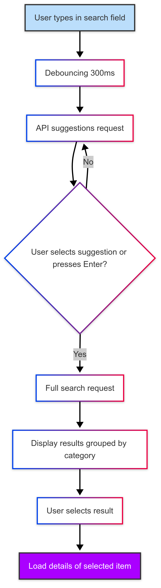
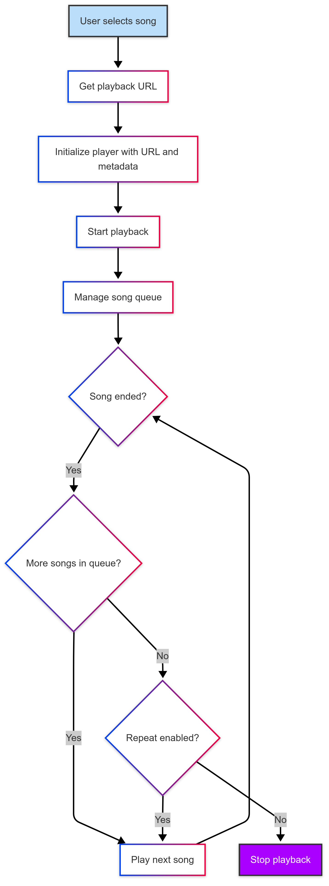
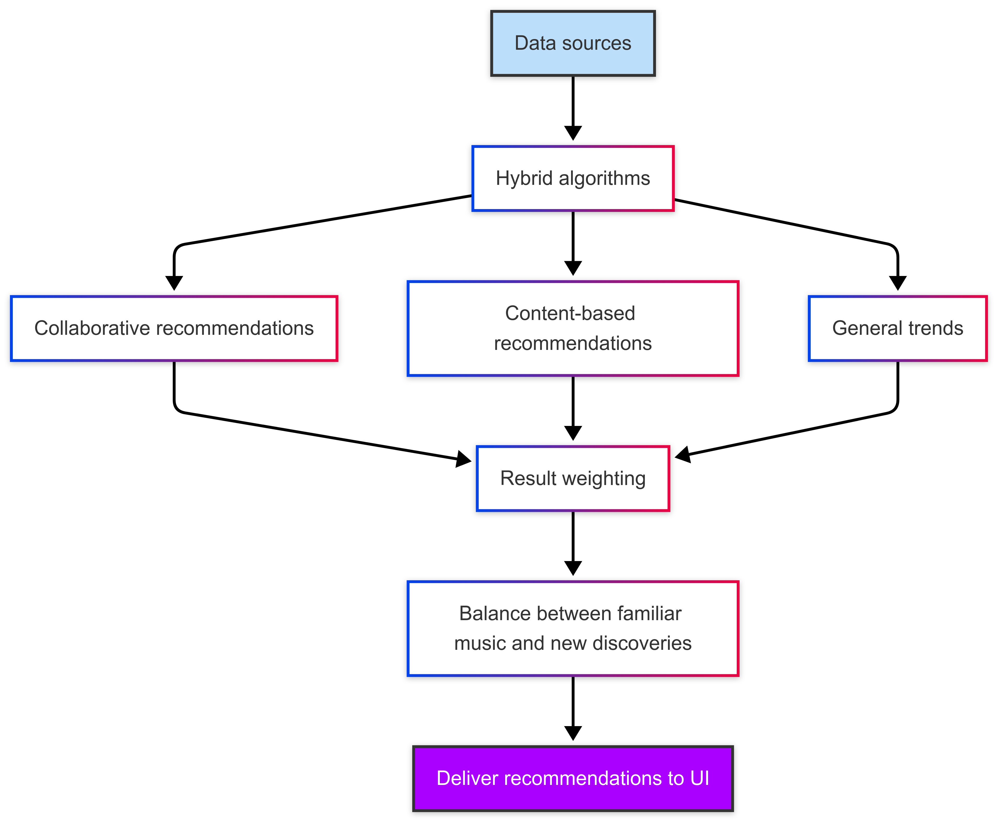

# Technical Documentation - FreeVibes Web

<div align="center">
  
  <h3>Architecture and Implementation Details</h3>
</div>

<div align="center">
  
  [ Home ](../../README.md) | [ Getting Started ](README.md) | [ Changelog ](CHANGELOG.md)
  
</div>

---

## Index

- [Architecture Overview](#architecture-overview)
- [Frontend](#frontend)
  - [Technologies](#technologies)
  - [Project Structure](#project-structure)
  - [Main Components](#main-components)
  - [Global State](#global-state)
  - [Performance Optimizations](#performance-optimizations)
- [Node.js Backend](#nodejs-backend)
  - [Technologies](#technologies-1)
  - [APIs and Endpoints](#apis-and-endpoints)
  - [Cache Systems](#cache-systems)
  - [Error Handling](#error-handling)
- [FreeVibes API](#youtube-music-api)
  - [Technologies](#technologies-2)
  - [Endpoints](#endpoints)
  - [API Limitations](#api-limitations)
- [Integrations](#integrations)
  - [YouTube](#youtube)
  - [Spotify](#spotify)
  - [Last.fm](#lastfm)
  - [LRCLib](#lrclib)
- [Data Flows](#data-flows)
  - [Search](#search)
  - [Playback](#playback)
  - [Recommendations](#recommendations)
- [Database](#database)
  - [Schemas](#schemas)
  - [Indexes](#indexes)
- [Security](#security)
  - [Authentication](#authentication)
  - [CORS Configuration](#cors-configuration)
  - [API Key Protection](#api-key-protection)
- [Deployment](#deployment)
  - [Vercel Configuration](#vercel-configuration)
  - [Render Configuration](#render-configuration)
- [Local Development](#local-development)
  - [Requirements](#requirements)
  - [Development Environment](#development-environment)
  - [Testing](#testing)
- [Extensibility](#extensibility)
  - [Adding New Sources](#adding-new-sources)
  - [Player Customization](#player-customization)

---

## Architecture Overview

I've built FreeVibes Web following a microservices architecture, with three main components working together:

<div align="center">
  
</div>

### System Components

1. **Next.js Frontend (Vercel)**
   - User interface and client logic
   - Hybrid rendering (SSR/CSR/ISR)

2. **Node.js Backend (Render)**
   - Intermediation with music APIs
   - Response format unification
   - Caching of frequent results
   - Main business logic

3. **FreeVibes API (Render)**
   - Specialized access to FreeVibes
   - Format conversion
   - Metadata and playback URL extraction

### Communication Between Services

- **Client-Frontend**: HTTP/HTTPS requests
- **Frontend-Backend**: REST API fetches
- **Backend-YouTube API**: API calls through specialized library

## Frontend

### Technologies

- **Next.js 14**: React framework with server-side rendering
- **React 18**: UI library
- **TypeScript**: Static typing for JavaScript
- **TailwindCSS**: Utility-first CSS framework
- **ShadcnUI**: Reusable UI components based on Radix UI
- **Zustand**: Lightweight global state management
- **React Query**: Data fetching, caching, and synchronization

### Project Structure

```
app/
├── (routes)/                   # Application routes
│   ├── explore/                # Exploration page
│   ├── search/                 # Search page
│   ├── artist/                 # Artist pages
│   ├── track/                  # Track pages
│   ├── playlist/               # Playlist pages
│   └── profile/                # User profile pages
├── api/                        # Next.js API routes
│   ├── auth/                   # Authentication routes
│   ├── proxy/                  # Proxy for external APIs
│   └── combined/               # Combined endpoints
├── components/                 # React components
│   ├── ui/                     # Base UI components
│   ├── player/                 # Player components
│   ├── search/                 # Search components
│   ├── cards/                  # Content cards
│   └── layout/                 # Layout components
├── hooks/                      # Custom hooks
├── lib/                        # Utilities and configuration
├── providers/                  # Context providers
├── services/                   # Data services
├── store/                      # Global state (Zustand)
└── types/                      # Type definitions
```

### Main Components

#### Music Player

The music player is a complex component I've developed with:

- **PlayerCore**: Playback core based on `react-player` with support for multiple providers
- **PlayerControls**: Playback controls (play, pause, next, previous, volume)
- **PlayerQueue**: Playback queue system
- **PlayerVisualizer**: Audio visualizers (spectrum, waves)

```typescript
// Simplified player example
export function MusicPlayer() {
  const { 
    currentTrack, 
    isPlaying, 
    volume, 
    playbackRate,
    togglePlay, 
    setVolume 
  } = usePlayerStore();
  
  // Determine player source
  const getPlayerUrl = () => {
    if (!currentTrack) return null;
    
    // Prioritize YouTube if available
    if (currentTrack.youtubeId) {
      return `https://www.youtube.com/watch?v=${currentTrack.youtubeId}`;
    }
    
    // Fallback to other sources
    return currentTrack.sourceUrl;
  };
  
  // Event handling
  const handleProgress = (state) => {
    // Update progress state
  };
  
  const handleEnded = () => {
    // Move to next song
  };
  
  return (
    <div className="player-container">
      <ReactPlayer
        url={getPlayerUrl()}
        playing={isPlaying}
        volume={volume}
        playbackRate={playbackRate}
        onProgress={handleProgress}
        onEnded={handleEnded}
        config={{
          youtube: {
            playerVars: {
              disablekb: 1,
              modestbranding: 1,
              showinfo: 0,
              rel: 0,
              iv_load_policy: 3
            }
          }
        }}
      />
      
      <PlayerControls />
      <PlayerQueue />
    </div>
  );
}
```

#### Universal Search

I've designed the search system to unify results from multiple sources:

- **Real-time search** with debounce
- **Smart suggestions** based on history and trends
- **Result caching** for quick responses

```typescript
// Unified search hook
export function useUnifiedSearch() {
  const [query, setQuery] = useState('');
  const [results, setResults] = useState([]);
  const [isLoading, setIsLoading] = useState(false);
  
  // Debounced search
  useEffect(() => {
    if (!query || query.length < 3) {
      setResults([]);
      return;
    }
    
    const handler = setTimeout(async () => {
      try {
        setIsLoading(true);
        
        // Perform combined API search
        const response = await fetch(`/api/combined/search?q=${encodeURIComponent(query)}`);
        const data = await response.json();
        
        setResults(data);
      } catch (error) {
        console.error('Search error:', error);
      } finally {
        setIsLoading(false);
      }
    }, 300); // 300ms debounce
    
    return () => clearTimeout(handler);
  }, [query]);
  
  return { query, setQuery, results, isLoading };
}
```

### Global State

I use Zustand for global state management, with separation of concerns:

```typescript
// Player store
export const usePlayerStore = create<PlayerState & PlayerActions>()(
  persist(
    (set, get) => ({
      // State
      currentTrack: null,
      queue: [],
      queueIndex: 0,
      isPlaying: false,
      volume: 0.7,
      repeat: 'none',
      shuffle: false,
      
      // Actions
      setTrack: (track) => set({ currentTrack: track, isPlaying: true }),
      addToQueue: (track) => set((state) => ({ 
        queue: [...state.queue, track] 
      })),
      playQueue: (tracks, startIndex = 0) => set({ 
        queue: tracks, 
        queueIndex: startIndex,
        currentTrack: tracks[startIndex],
        isPlaying: true
      }),
      togglePlay: () => set((state) => ({ 
        isPlaying: !state.isPlaying 
      })),
      nextTrack: () => {
        const { queue, queueIndex, repeat } = get();
        if (queueIndex >= queue.length - 1) {
          if (repeat === 'all') {
            set({ queueIndex: 0, currentTrack: queue[0] });
          } else {
            set({ isPlaying: false });
          }
        } else {
          set({ 
            queueIndex: queueIndex + 1,
            currentTrack: queue[queueIndex + 1]
          });
        }
      },
      prevTrack: () => {/* Similar implementation */},
      toggleRepeat: () => {/* Implementation */},
      toggleShuffle: () => {/* Implementation */},
    }),
    {
      name: 'music-player-store',
      partialize: (state) => ({ 
        volume: state.volume,
        repeat: state.repeat,
        shuffle: state.shuffle
      }),
    }
  )
);
```

### Performance Optimizations

I've implemented various performance optimizations:

- **ISR (Incremental Static Regeneration)** for frequently visited pages
- **Lazy loading** of heavy components
- **Virtualization** for long lists (using `react-virtualized`)
- **Code splitting** automatically by Next.js
- **Image optimization** using `next/image`
- **Smart prefetching** for instant navigation

## Node.js Backend

### Technologies

- **Node.js 18**: Runtime environment
- **Express**: REST API framework
- **Axios**: HTTP client for API requests
- **Node-Cache**: In-memory caching system
- **CORS**: Middleware for Cross-Origin Resource Sharing
- **Helmet**: HTTP security middleware

### APIs and Endpoints

#### Main Endpoints

```
/api/youtube/
  ├── search            # YouTube search
  ├── video/:id         # Video metadata
  ├── suggestions       # Search suggestions
  └── trending          # Trending videos

/api/spotify/
  ├── search            # Spotify search
  ├── track/:id         # Track metadata
  ├── artist/:id        # Artist metadata
  └── recommendations   # Recommendations

/api/lastfm/
  ├── search            # Last.fm search
  ├── artist/:name      # Artist information
  └── similar/:name     # Similar artists

/api/combined/
  ├── search            # Unified search
  ├── suggest           # Autocomplete suggestions
  └── recommendations   # Combined recommendations
```

#### Endpoint Example: Combined Search

```javascript
// Combined search endpoint
app.get('/api/combined/search', async (req, res) => {
  try {
    const { q, limit = 20, type = 'all' } = req.query;
    const cacheKey = `search_${q}_${type}_${limit}`;
    
    // Check cache
    const cachedResults = searchCache.get(cacheKey);
    if (cachedResults) {
      return res.json(cachedResults);
    }
    
    // Combined results
    let combinedResults = {
      tracks: [],
      artists: [],
      albums: [],
      playlists: []
    };
    
    // Execute searches in parallel
    const promises = [];
    
    // FreeVibes
    if (['all', 'tracks', 'videos'].includes(type)) {
      promises.push(
        axios.get(`${YTMUSIC_API_URL}/search`, { 
          params: { query: q, limit } 
        })
        .then(response => {
          combinedResults.tracks = [
            ...combinedResults.tracks,
            ...response.data.map(formatYouTubeResult)
          ];
        })
        .catch(error => console.error('YouTube search error:', error))
      );
    }
    
    // Spotify
    if (['all', 'tracks', 'artists', 'albums'].includes(type)) {
      const spotifyToken = await getSpotifyToken();
      
      promises.push(
        axios.get('https://api.spotify.com/v1/search', {
          params: {
            q,
            type: 'track,artist,album',
            limit
          },
          headers: {
            'Authorization': `Bearer ${spotifyToken}`
          }
        })
        .then(response => {
          // Process tracks
          if (response.data.tracks) {
            combinedResults.tracks = [
              ...combinedResults.tracks,
              ...response.data.tracks.items.map(formatSpotifyTrack)
            ];
          }
          
          // Process artists
          if (response.data.artists) {
            combinedResults.artists = [
              ...combinedResults.artists,
              ...response.data.artists.items.map(formatSpotifyArtist)
            ];
          }
          
          // Process albums
          if (response.data.albums) {
            combinedResults.albums = [
              ...combinedResults.albums,
              ...response.data.albums.items.map(formatSpotifyAlbum)
            ];
          }
        })
        .catch(error => console.error('Spotify search error:', error))
      );
    }
    
    // Last.fm - Only if artists or tracks are requested
    if (['all', 'tracks', 'artists'].includes(type)) {
      promises.push(
        suggestionProviders.lastfm(q, limit)
          .then(suggestions => {
            // Extract artists
            const artists = suggestions
              .filter(item => item.type === 'artist')
              .map(formatLastfmArtist);
            
            // Extract tracks
            const tracks = suggestions
              .filter(item => item.type === 'track')
              .map(formatLastfmTrack);
            
            combinedResults.artists = [
              ...combinedResults.artists,
              ...artists
            ];
            
            combinedResults.tracks = [
              ...combinedResults.tracks,
              ...tracks
            ];
          })
          .catch(error => console.error('Last.fm search error:', error))
      );
    }
    
    // Wait for all searches to complete
    await Promise.all(promises);
    
    // Remove duplicates and sort results
    Object.keys(combinedResults).forEach(key => {
      if (combinedResults[key].length > 0) {
        // Remove duplicates by ID
        combinedResults[key] = eliminateDuplicates(combinedResults[key]);
        
        // Sort by relevance (custom implementation)
        combinedResults[key] = sortByRelevance(combinedResults[key], q);
        
        // Limit results
        combinedResults[key] = combinedResults[key].slice(0, limit);
      }
    });
    
    // Cache results
    searchCache.set(cacheKey, combinedResults, 3600); // 1 hour TTL
    
    // Return results
    res.json(combinedResults);
  } catch (error) {
    console.error('Combined search error:', error);
    res.status(500).json({ 
      error: 'Error performing combined search',
      message: error.message
    });
  }
});
```

### Cache Systems

I've implemented several caching levels to improve performance:

```javascript
// Cache definitions
const searchCache = new NodeCache({ stdTTL: 3600, checkperiod: 600 }); // 1 hour
const suggestionCache = new NodeCache({ stdTTL: 7200, checkperiod: 600 }); // 2 hours
const trackCache = new NodeCache({ stdTTL: 86400, checkperiod: 3600 }); // 24 hours
const artistCache = new NodeCache({ stdTTL: 604800, checkperiod: 3600 }); // 7 days
```

- **Search cache**: Stores results from frequent searches
- **Suggestions cache**: Optimizes the autocomplete system
- **Metadata cache**: Reduces API calls for popular tracks and artists
- **Stale-while-revalidate strategy**: Returns cached data while refreshing in the background

### Error Handling

I've developed a centralized error handling system:

```javascript
// Error catching middleware
app.use((err, req, res, next) => {
  console.error('Server error:', err);
  
  // Determine error type
  if (err.response) {
    // External API response error
    const status = err.response.status || 500;
    const message = err.response.data?.message || 'External service error';
    
    return res.status(status).json({
      error: message,
      code: status,
      path: req.path
    });
  }
  
  // Runtime error
  const status = err.status || 500;
  const message = err.message || 'Internal server error';
  
  res.status(status).json({
    error: message,
    code: status,
    path: req.path
  });
});
```

## FreeVibes API

### Technologies

- **Python 3.8+**: Base language
- **Flask**: Web microframework
- **YTMusicAPI**: Library to interact with FreeVibes
- **Gunicorn**: WSGI server for production
- **Flask-CORS**: CORS management
- **Python-dotenv**: Environment variable management

### Endpoints

```
/
  ├── /search                  # General search
  ├── /search/songs            # Song search
  ├── /search/videos           # Video search
  ├── /search/albums           # Album search
  ├── /search/artists          # Artist search
  ├── /artist/:id              # Artist details
  ├── /album/:id               # Album details
  ├── /song/:id                # Song details
  ├── /video/:id               # Video details
  ├── /lyrics/:id              # Song lyrics
  ├── /suggestions             # Search suggestions
  └── /trending                # Trending
```

### API Limitations

The FreeVibes API imposes certain limitations:

- Non-commercial use recommended
- IP-based rate limiting
- No official access through public API
- Possible changes in HTML/API structure without notice

## Integrations

### YouTube

#### Configuration

- **API Key**: Required for YouTube Data API v3
- **YTMusicAPI**: Python library for unofficial access to FreeVibes
- **Oauth**: Not required for basic functionality

#### Used Endpoints

- **YouTube Data API v3**:
  - `/search`: Video search
  - `/videos`: Video details
  - `/playlists`: Playlists
  - `/channels`: Channel information

- **FreeVibes (Unofficial)**:
  - Advanced music search
  - Recommendations
  - Lyrics
  - High-quality metadata

### Spotify

#### Configuration

- **Client ID and Secret**: Application credentials
- **Authorization**: Client Credentials flow
- **Token Management**: Automatic renewal

#### Used Endpoints

- `/search`: Unified search
- `/recommendations`: Recommendations based on genres and seeds
- `/tracks`: Track details
- `/artists`: Artist information
- `/albums`: Album information

### Last.fm

#### Configuration

- **API Key**: Required for all requests
- **Format**: JSON preferred over XML

#### Used Endpoints

- `artist.search`: Artist search
- `track.search`: Track search
- `album.search`: Album search
- `tag.getTopTracks`: Popular tracks by genre

### LRCLib

#### Configuration

- **No API Key**: No registration or authentication required for usage
- **No Rate Limiting**: Open access for all applications
- **Recommended Header**: The `Lrclib-Client` header is included to identify the application

#### Used Endpoints

- `/api/get`: Find lyrics using track signature (title, artist, album, duration)
- `/api/get/{id}`: Retrieve lyrics by specific ID
- `/api/search`: Search for lyrics using keywords

#### Implemented Features

- **Synchronized Lyrics**: Display lyrics in real-time during playback
- **Plain Lyrics**: Alternative for songs without synchronized lyrics
- **Instrumental Detection**: Automatic identification of tracks without lyrics
- **Lyrics Caching**: Local storage to reduce repeated requests

## Data Flows

### Search

I've designed the following complete flow for the search process:

1. **User input**: User types in the search field
2. **Debouncing**: Wait for 300ms of inactivity
3. **Suggestions**: Request suggestions from `/api/combined/suggest`
4. **Selection/Enter**: User selects a suggestion or presses Enter
5. **Full search**: Send the query to `/api/combined/search`
6. **Unified results**: Display grouped by category
7. **Details**: When clicking on a result, load additional details

<div align="center">
  
  <p><em>Flow diagram of the universal search process</em></p>
</div>

### Playback

The flow I've implemented for the playback system is:

1. **Song selection**: User selects a song
2. **URL retrieval**: Determine the optimal source for playback
3. **Player initialization**: Configure with URL and metadata
4. **Playback**: Playback begins
5. **Queue**: Manage upcoming songs
6. **Events**: Handle events like end of playback, errors, etc.
7. **Transitions**: Perform smooth transitions between songs

<div align="center">
  
  <p><em>Flow diagram of the music playback system</em></p>
</div>

### Recommendations

I've developed a recommendation system that works like this:

1. **Data sources**: User history, trends, preferred genres
2. **Hybrid algorithms**: Combination of:
   - Collaborative recommendations
   - Content-based recommendations
   - General trends
3. **Weighting**: Higher weight to personal preferences
4. **Exploration vs Exploitation**: Balance between familiar music and discoveries
5. **Results delivery**: Unified formats for UI

<div align="center">
  
  <p><em>Flow diagram of the personalized recommendation system</em></p>
</div>

## Database

### Schemas

```javascript
// User Schema
const userSchema = new Schema({
  username: { type: String, required: true, unique: true },
  email: { type: String, required: true, unique: true },
  passwordHash: { type: String, required: true },
  createdAt: { type: Date, default: Date.now },
  preferences: {
    theme: { type: String, default: 'system' },
    audioQuality: { type: String, default: 'auto' },
    preferredSource: { type: String, default: 'youtube' }
  },
  stats: {
    playCount: { type: Number, default: 0 },
    favoriteGenres: [String],
    lastActive: Date
  }
});

// Playlist Schema
const playlistSchema = new Schema({
  name: { type: String, required: true },
  description: String,
  owner: { type: Schema.Types.ObjectId, ref: 'User', required: true },
  isPublic: { type: Boolean, default: true },
  createdAt: { type: Date, default: Date.now },
  updatedAt: { type: Date, default: Date.now },
  coverImage: String,
  tracks: [{
    id: String,
    title: String,
    artist: String,
    album: String,
    duration: Number,
    addedAt: { type: Date, default: Date.now },
    sourceType: { type: String, enum: ['youtube', 'spotify', 'lastfm'] },
    sourceId: String
  }]
});

// History Schema
const historySchema = new Schema({
  user: { type: Schema.Types.ObjectId, ref: 'User', required: true },
  track: {
    id: String,
    title: String,
    artist: String,
    album: String,
    duration: Number,
    sourceType: { type: String, enum: ['youtube', 'spotify', 'lastfm'] },
    sourceId: String
  },
  timestamp: { type: Date, default: Date.now },
  playDuration: Number, // Played duration in ms
  completed: Boolean // If played completely
});
```

### Indexes

```javascript
// Indexes for query optimization
userSchema.index({ username: 1 });
userSchema.index({ email: 1 });
playlistSchema.index({ owner: 1 });
playlistSchema.index({ isPublic: 1 });
historySchema.index({ user: 1, timestamp: -1 });
historySchema.index({ 'track.artist': 1 });
historySchema.index({ 'track.sourceType': 1 });
```

## Security

### Authentication

I've implemented the following security mechanisms:

- **JWT (JSON Web Tokens)**: For user authentication
- **Refresh Tokens**: For session renewal
- **Secure storage strategies**: HttpOnly Cookies + Memory
- **OAuth**: For authentication with external providers

### CORS Configuration

```javascript
// CORS configuration
const corsOptions = {
  origin: process.env.NODE_ENV === 'production'
    ? [process.env.FRONTEND_URL] // Only production origin
    : ['http://localhost:3000'], // Local development
  methods: ['GET', 'POST', 'PUT', 'DELETE'],
  allowedHeaders: ['Content-Type', 'Authorization'],
  credentials: true,
  maxAge: 86400 // 1 day
};

app.use(cors(corsOptions));
```

### API Key Protection

- **Environment variables**: Secure storage of keys
- **API Proxy**: Never expose keys to the client
- **Rate limiting**: Protection against abuse

## Deployment

### Vercel Configuration

```json
// vercel.json
{
  "version": 2,
  "builds": [
    {
      "src": "package.json",
      "use": "@vercel/next"
    }
  ],
  "routes": [
    {
      "src": "/api/combined/(.*)",
      "dest": "/api/combined/$1"
    },
    {
      "src": "/api/proxy/(.*)",
      "dest": "/api/proxy/$1"
    },
    {
      "src": "/(.*)",
      "dest": "/$1"
    }
  ],
  "env": {
    "NEXT_PUBLIC_API_URL": "/api",
    "NEXT_PUBLIC_NODE_API_URL": "https://your-node-api.onrender.com"
  }
}
```

### Render Configuration

#### Node.js Service

```yaml
# render.yaml
services:
  - type: web
    name: youtube-music-node
    env: node
    buildCommand: cd node-server && npm install
    startCommand: cd node-server && node server.js
    envVars:
      - key: NODE_ENV
        value: production
      - key: PORT
        value: 10000
      - key: CORS_ORIGIN
        value: https://your-frontend.vercel.app
      - key: YOUTUBE_API_KEY
        sync: false
      - key: SPOTIFY_CLIENT_ID
        sync: false
      - key: SPOTIFY_CLIENT_SECRET
        sync: false
      - key: LASTFM_API_KEY
        sync: false
      - key: PYTHON_API_URL
        value: https://your-python-api.onrender.com
```

#### Python Service

```yaml
  - type: web
    name: youtube-music-python
    env: python
    buildCommand: cd python-api && pip install -r requirements.txt
    startCommand: cd python-api && gunicorn app:app
    envVars:
      - key: FLASK_ENV
        value: production
      - key: PORT
        value: 10000
      - key: CORS_ORIGIN
        value: https://your-frontend.vercel.app,https://your-node-api.onrender.com
      - key: YOUTUBE_API_KEY
        sync: false
```

## Local Development

### Requirements

- **Node.js 18+**
- **Python 3.8+**
- **npm or yarn**
- **pipenv (recommended)**
- **MongoDB** (optional, for full functionality)

### Development Environment

#### Environment Variables

Create a `.env` file in the project root:

```
# General
NODE_ENV=development
NEXT_PUBLIC_APP_URL=http://localhost:3000

# API URLs
NEXT_PUBLIC_API_URL=http://localhost:3000/api
NEXT_PUBLIC_NODE_API_URL=http://localhost:3000
YTMUSIC_API_URL=http://localhost:3001/api/youtube
NODE_SERVER_URL=http://localhost:3001
PYTHON_API_URL=http://localhost:5000
NEXT_PUBLIC_PYTHON_API_URL=http://localhost:5000

# Spotify API
SPOTIFY_CLIENT_ID=your_client_id
SPOTIFY_CLIENT_SECRET=your_client_secret
NEXT_PUBLIC_SPOTIFY_CLIENT_ID=your_client_id
SPOTIFY_API_LIMIT=100

# Last.fm API
LASTFM_API_KEY=your_api_key
LASTFM_SHARED_SECRET=your_shared_secret
LASTFM_API_LIMIT=200

# YouTube API
YOUTUBE_API_KEY=your_api_key
YOUTUBE_API_LIMIT=50

# MongoDB
MONGODB_URI=mongodb://localhost:27017/freevibes

# JWT
JWT_SECRET=your_jwt_secret
JWT_EXPIRATION=1d
JWT_REFRESH_SECRET=your_refresh_secret
JWT_REFRESH_EXPIRATION=7d

# Cache configuration
CACHE_TTL=86400000
GENRE_CACHE_TTL=604800000
SEARCH_CACHE_TTL=3600000

# Ports
PORT=5000
SERVER_PORT=3001
```

### Testing

For testing, I use the following tools:

- **Jest**: For unit tests
- **React Testing Library**: For component tests
- **Cypress**: For end-to-end tests
- **Supertest**: For API tests

```javascript
// Unit test example
describe('PlayerControls', () => {
  it('should toggle play state when play button is clicked', () => {
    const togglePlay = jest.fn();
    const { getByLabelText } = render(
      <PlayerControls 
        isPlaying={false} 
        togglePlay={togglePlay} 
      />
    );
    
    fireEvent.click(getByLabelText('Play'));
    expect(togglePlay).toHaveBeenCalledTimes(1);
  });
});
```

## Extensibility

### Adding New Sources

I've designed the system to be extensible. To add a new music source:

1. **Create an adapter** in `/services/sources/`
2. **Implement the common interface**:
   - `search`: Search in the source
   - `getTrackDetails`: Get track details
   - `getStreamUrl`: Get playback URL
   - `getRecommendations`: Get recommendations
3. **Register the adapter** in the provider system
4. **Update combined APIs** to include the new source

```typescript
// Adapter example for new source
export class NewMusicSourceAdapter implements MusicSourceAdapter {
  async search(query: string, options: SearchOptions): Promise<SearchResults> {
    // Search implementation
  }
  
  async getTrackDetails(id: string): Promise<Track> {
    // Implementation to get details
  }
  
  async getStreamUrl(id: string): Promise<string> {
    // Implementation to get playback URL
  }
  
  async getRecommendations(seed: RecommendationSeed): Promise<Track[]> {
    // Implementation for recommendations
  }
}

// Register adapter
registerMusicSource('newSource', new NewMusicSourceAdapter());
```

### Player Customization

The player is designed to be extensible through plugins:

```typescript
// Player plugin system
export interface PlayerPlugin {
  name: string;
  initialize: (player: PlayerCore) => void;
  onTrackChange?: (track: Track) => void;
  onPlayStateChange?: (isPlaying: boolean) => void;
  onProgress?: (progress: number) => void;
  beforePlay?: (track: Track) => Promise<Track | null>;
  afterPlay?: (track: Track) => void;
  destroy?: () => void;
}

// Analytics plugin example
const analyticsPlugin: PlayerPlugin = {
  name: 'analytics',
  initialize: (player) => {
    console.log('Analytics plugin initialized');
  },
  onTrackChange: (track) => {
    // Send track change event
    trackEvent('play_track', {
      trackId: track.id,
      trackName: track.title,
      artist: track.artist,
      source: track.source
    });
  },
  onPlayStateChange: (isPlaying) => {
    trackEvent('player_state_change', { isPlaying });
  }
};

// Register plugin
playerCore.registerPlugin(analyticsPlugin);
```

---

<div align="center">
  <p>© 2025 FreeVibes Web - Technical Documentation</p>
</div> 