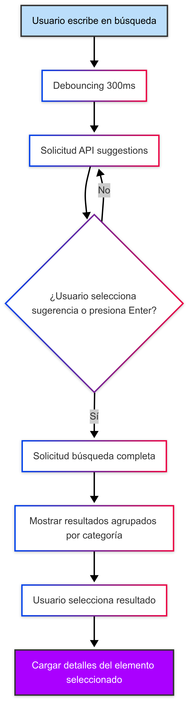
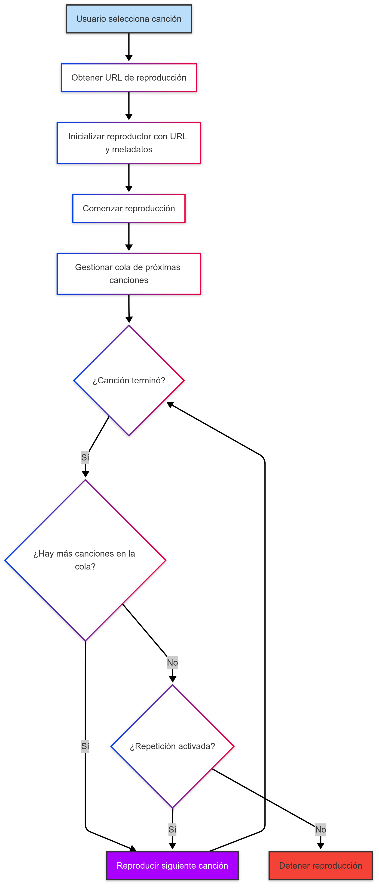
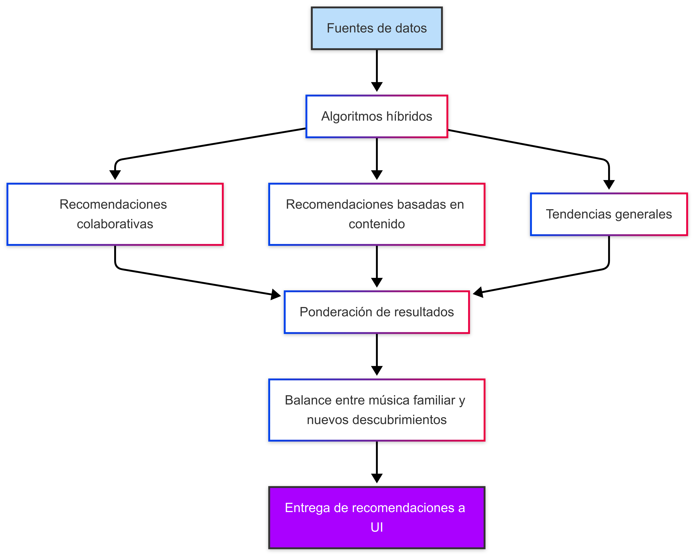

# Documentación Técnica - FreeVibes Web

<div align="center">
  
  <h3>Arquitectura y detalles de implementación</h3>
</div>

<div align="center">
  
  [ Inicio ](../../README.md) | [ Guía de Inicio ](README.md) | [ Historial de Cambios ](CHANGELOG.md)
  
</div>

---

## Índice

- [Visión General de la Arquitectura](#visión-general-de-la-arquitectura)
- [Frontend](#frontend)
  - [Tecnologías](#tecnologías)
  - [Estructura del Proyecto](#estructura-del-proyecto)
  - [Componentes Principales](#componentes-principales)
  - [Estado Global](#estado-global)
  - [Optimizaciones de Rendimiento](#optimizaciones-de-rendimiento)
- [Backend Node.js](#backend-nodejs)
  - [Tecnologías](#tecnologías-1)
  - [APIs y Endpoints](#apis-y-endpoints)
  - [Sistemas de Caché](#sistemas-de-caché)
  - [Manejo de Errores](#manejo-de-errores)
- [API de FreeVibes](#api-de-youtube-music)
  - [Tecnologías](#tecnologías-2)
  - [Endpoints](#endpoints)
  - [Limitaciones de la API](#limitaciones-de-la-api)
- [Integraciones](#integraciones)
  - [YouTube](#youtube)
  - [Spotify](#spotify)
  - [Last.fm](#lastfm)
  - [LRCLib](#lrclib)
- [Flujos de Datos](#flujos-de-datos)
  - [Búsqueda](#búsqueda)
  - [Reproducción](#reproducción)
  - [Recomendaciones](#recomendaciones)
- [Base de Datos](#base-de-datos)
  - [Esquemas](#esquemas)
  - [Índices](#índices)
- [Seguridad](#seguridad)
  - [Autenticación](#autenticación)
  - [Configuración CORS](#configuración-cors)
  - [Protección de Claves API](#protección-de-claves-api)
- [Despliegue](#despliegue)
  - [Configuración Vercel](#configuración-vercel)
  - [Configuración Render](#configuración-render)
- [Desarrollo Local](#desarrollo-local)
  - [Requisitos](#requisitos)
  - [Entorno de Desarrollo](#entorno-de-desarrollo)
  - [Testing](#testing)
- [Extensibilidad](#extensibilidad)
  - [Agregar Nuevas Fuentes](#agregar-nuevas-fuentes)
  - [Personalización del Reproductor](#personalización-del-reproductor)

---

## Visión General de la Arquitectura

He construido FreeVibes Web siguiendo una arquitectura de microservicios, con tres componentes principales que trabajan en conjunto:

<div align="center">
  
</div>

### Componentes del Sistema

1. **Frontend Next.js (Vercel)**
   - Interfaz de usuario y lógica de cliente
   - Renderizado híbrido (SSR/CSR/ISR)

2. **Backend Node.js (Render)**
   - Intermediación con las APIs de música
   - Unificación de formatos de respuesta
   - Cacheo de resultados frecuentes
   - Lógica de negocio principal

3. **API de FreeVibes (Render)**
   - Acceso especializado a FreeVibes
   - Conversión de formatos
   - Extracción de metadatos y URLs de reproducción

### Comunicación entre Servicios

- **Cliente-Frontend**: Peticiones HTTP/HTTPS
- **Frontend-Backend**: Fetches API REST
- **Backend-YouTube API**: Llamadas API mediante biblioteca especializada

## Frontend

### Tecnologías

- **Next.js 14**: Framework React con renderizado del lado del servidor
- **React 18**: Biblioteca para interfaces de usuario
- **TypeScript**: Tipado estático para JavaScript
- **TailwindCSS**: Framework CSS utility-first
- **ShadcnUI**: Componentes UI reutilizables basados en Radix UI
- **Zustand**: Gestión de estado global ligero
- **React Query**: Fetching, cacheo y sincronización de datos

### Estructura del Proyecto

```
app/
├── (routes)/                   # Rutas de la aplicación
│   ├── explore/                # Página de exploración
│   ├── search/                 # Página de búsqueda
│   ├── artist/                 # Páginas de artistas
│   ├── track/                  # Páginas de canciones
│   ├── playlist/               # Páginas de playlists
│   └── profile/                # Páginas de perfil de usuario
├── api/                        # API routes de Next.js
│   ├── auth/                   # Rutas de autenticación
│   ├── proxy/                  # Proxy para APIs externas
│   └── combined/               # Endpoints combinados
├── components/                 # Componentes React
│   ├── ui/                     # Componentes UI base
│   ├── player/                 # Componentes del reproductor
│   ├── search/                 # Componentes de búsqueda
│   ├── cards/                  # Tarjetas de contenido
│   └── layout/                 # Componentes de layout
├── hooks/                      # Custom hooks
├── lib/                        # Utilidades y configuración
├── providers/                  # Proveedores de contexto
├── services/                   # Servicios de datos
├── store/                      # Estado global (Zustand)
└── types/                      # Definiciones de tipos
```

### Componentes Principales

#### Reproductor de Música

El reproductor de música es un componente complejo que he desarrollado con:

- **PlayerCore**: Núcleo de reproducción basado en `react-player` con soporte para múltiples proveedores
- **PlayerControls**: Controles de reproducción (play, pause, siguiente, anterior, volumen)
- **PlayerQueue**: Sistema de cola de reproducción
- **PlayerVisualizer**: Visualizadores de audio (espectro, ondas)

```typescript
// Ejemplo simplificado del reproductor
export function MusicPlayer() {
  const { 
    currentTrack, 
    isPlaying, 
    volume, 
    playbackRate,
    togglePlay, 
    setVolume 
  } = usePlayerStore();
  
  // Determinar la fuente del reproductor
  const getPlayerUrl = () => {
    if (!currentTrack) return null;
    
    // Priorizar YouTube si está disponible
    if (currentTrack.youtubeId) {
      return `https://www.youtube.com/watch?v=${currentTrack.youtubeId}`;
    }
    
    // Fallback a otras fuentes
    return currentTrack.sourceUrl;
  };
  
  // Manejo de eventos
  const handleProgress = (state) => {
    // Actualizar estado de progreso
  };
  
  const handleEnded = () => {
    // Pasar a la siguiente canción
  };
  
  return (
    <div className="player-container">
      <ReactPlayer
        url={getPlayerUrl()}
        playing={isPlaying}
        volume={volume}
        playbackRate={playbackRate}
        onProgress={handleProgress}
        onEnded={handleEnded}
        config={{
          youtube: {
            playerVars: {
              disablekb: 1,
              modestbranding: 1,
              showinfo: 0,
              rel: 0,
              iv_load_policy: 3
            }
          }
        }}
      />
      
      <PlayerControls />
      <PlayerQueue />
    </div>
  );
}
```

#### Búsqueda Universal

He diseñado el sistema de búsqueda para unificar resultados de múltiples fuentes:

- **Búsqueda en tiempo real** con debounce
- **Sugerencias inteligentes** basadas en historial y tendencias
- **Caché de resultados** para respuestas rápidas

```typescript
// Hook de búsqueda unificada
export function useUnifiedSearch() {
  const [query, setQuery] = useState('');
  const [results, setResults] = useState([]);
  const [isLoading, setIsLoading] = useState(false);
  
  // Búsqueda con debounce
  useEffect(() => {
    if (!query || query.length < 3) {
      setResults([]);
      return;
    }
    
    const handler = setTimeout(async () => {
      try {
        setIsLoading(true);
        
        // Realizar búsqueda en API combinada
        const response = await fetch(`/api/combined/search?q=${encodeURIComponent(query)}`);
        const data = await response.json();
        
        setResults(data);
      } catch (error) {
        console.error('Error en búsqueda:', error);
      } finally {
        setIsLoading(false);
      }
    }, 300); // 300ms debounce
    
    return () => clearTimeout(handler);
  }, [query]);
  
  return { query, setQuery, results, isLoading };
}
```

### Estado Global

Utilizo Zustand para la gestión del estado global, con separación de concerns:

```typescript
// Store del reproductor
export const usePlayerStore = create<PlayerState & PlayerActions>()(
  persist(
    (set, get) => ({
      // Estado
      currentTrack: null,
      queue: [],
      queueIndex: 0,
      isPlaying: false,
      volume: 0.7,
      repeat: 'none',
      shuffle: false,
      
      // Acciones
      setTrack: (track) => set({ currentTrack: track, isPlaying: true }),
      addToQueue: (track) => set((state) => ({ 
        queue: [...state.queue, track] 
      })),
      playQueue: (tracks, startIndex = 0) => set({ 
        queue: tracks, 
        queueIndex: startIndex,
        currentTrack: tracks[startIndex],
        isPlaying: true
      }),
      togglePlay: () => set((state) => ({ 
        isPlaying: !state.isPlaying 
      })),
      nextTrack: () => {
        const { queue, queueIndex, repeat } = get();
        if (queueIndex >= queue.length - 1) {
          if (repeat === 'all') {
            set({ queueIndex: 0, currentTrack: queue[0] });
          } else {
            set({ isPlaying: false });
          }
        } else {
          set({ 
            queueIndex: queueIndex + 1,
            currentTrack: queue[queueIndex + 1]
          });
        }
      },
      prevTrack: () => {/* Implementación similar */},
      toggleRepeat: () => {/* Implementación */},
      toggleShuffle: () => {/* Implementación */},
    }),
    {
      name: 'music-player-store',
      partialize: (state) => ({ 
        volume: state.volume,
        repeat: state.repeat,
        shuffle: state.shuffle
      }),
    }
  )
);
```

### Optimizaciones de Rendimiento

He implementado diversas optimizaciones para el rendimiento:

- **ISR (Incremental Static Regeneration)** para páginas frecuentemente visitadas
- **Lazy loading** de componentes pesados
- **Virtualización** para listas largas (utilizando `react-virtualized`)
- **Code splitting** automático de Next.js
- **Optimización de imágenes** mediante `next/image`
- **Prefetching** inteligente para navegación instantánea

## Backend Node.js

### Tecnologías

- **Node.js 18**: Entorno de ejecución
- **Express**: Framework para APIs REST
- **Axios**: Cliente HTTP para peticiones a APIs externas
- **Node-Cache**: Sistema de caché en memoria
- **CORS**: Middleware para gestionar Cross-Origin Resource Sharing
- **Helmet**: Middleware para seguridad HTTP

### APIs y Endpoints

#### Endpoints Principales

```
/api/youtube/
  ├── search            # Búsqueda en YouTube
  ├── video/:id         # Metadatos de vídeo
  ├── suggestions       # Sugerencias de búsqueda
  └── trending          # Vídeos en tendencia

/api/spotify/
  ├── search            # Búsqueda en Spotify
  ├── track/:id         # Metadatos de canción
  ├── artist/:id        # Metadatos de artista
  └── recommendations   # Recomendaciones

/api/lastfm/
  ├── search            # Búsqueda en Last.fm
  ├── artist/:name      # Información de artista
  └── similar/:name     # Artistas similares

/api/combined/
  ├── search            # Búsqueda unificada
  ├── suggest           # Sugerencias para autocompletado
  └── recommendations   # Recomendaciones combinadas
```

#### Ejemplo de Endpoint: Búsqueda Combinada

```javascript
// Endpoint de búsqueda combinada
app.get('/api/combined/search', async (req, res) => {
  try {
    const { q, limit = 20, type = 'all' } = req.query;
    const cacheKey = `search_${q}_${type}_${limit}`;
    
    // Comprobar caché
    const cachedResults = searchCache.get(cacheKey);
    if (cachedResults) {
      return res.json(cachedResults);
    }
    
    // Resultados combinados
    let combinedResults = {
      tracks: [],
      artists: [],
      albums: [],
      playlists: []
    };
    
    // Ejecutar búsquedas en paralelo
    const promises = [];
    
    // FreeVibes
    if (['all', 'tracks', 'videos'].includes(type)) {
      promises.push(
        axios.get(`${YTMUSIC_API_URL}/search`, { 
          params: { query: q, limit } 
        })
        .then(response => {
          combinedResults.tracks = [
            ...combinedResults.tracks,
            ...response.data.map(formatYouTubeResult)
          ];
        })
        .catch(error => console.error('YouTube search error:', error))
      );
    }
    
    // Spotify
    if (['all', 'tracks', 'artists', 'albums'].includes(type)) {
      const spotifyToken = await getSpotifyToken();
      
      promises.push(
        axios.get('https://api.spotify.com/v1/search', {
          params: {
            q,
            type: 'track,artist,album',
            limit
          },
          headers: {
            'Authorization': `Bearer ${spotifyToken}`
          }
        })
        .then(response => {
          // Procesar tracks
          if (response.data.tracks) {
            combinedResults.tracks = [
              ...combinedResults.tracks,
              ...response.data.tracks.items.map(formatSpotifyTrack)
            ];
          }
          
          // Procesar artistas
          if (response.data.artists) {
            combinedResults.artists = [
              ...combinedResults.artists,
              ...response.data.artists.items.map(formatSpotifyArtist)
            ];
          }
          
          // Procesar álbumes
          if (response.data.albums) {
            combinedResults.albums = [
              ...combinedResults.albums,
              ...response.data.albums.items.map(formatSpotifyAlbum)
            ];
          }
        })
        .catch(error => console.error('Spotify search error:', error))
      );
    }
    
    // Last.fm - Solo si se solicitan artistas o tracks
    if (['all', 'tracks', 'artists'].includes(type)) {
      promises.push(
        suggestionProviders.lastfm(q, limit)
          .then(suggestions => {
            // Extraer artistas
            const artists = suggestions
              .filter(item => item.type === 'artist')
              .map(formatLastfmArtist);
            
            // Extraer tracks
            const tracks = suggestions
              .filter(item => item.type === 'track')
              .map(formatLastfmTrack);
            
            combinedResults.artists = [
              ...combinedResults.artists,
              ...artists
            ];
            
            combinedResults.tracks = [
              ...combinedResults.tracks,
              ...tracks
            ];
          })
          .catch(error => console.error('Last.fm search error:', error))
      );
    }
    
    // Esperar a que todas las búsquedas terminen
    await Promise.all(promises);
    
    // Eliminar duplicados y ordenar resultados
    Object.keys(combinedResults).forEach(key => {
      if (combinedResults[key].length > 0) {
        // Eliminar duplicados por ID
        combinedResults[key] = eliminateDuplicates(combinedResults[key]);
        
        // Ordenar por relevancia (implementación personalizada)
        combinedResults[key] = sortByRelevance(combinedResults[key], q);
        
        // Limitar resultados
        combinedResults[key] = combinedResults[key].slice(0, limit);
      }
    });
    
    // Guardar en caché
    searchCache.set(cacheKey, combinedResults, 3600); // 1 hora TTL
    
    // Devolver resultados
    res.json(combinedResults);
  } catch (error) {
    console.error('Error en búsqueda combinada:', error);
    res.status(500).json({ 
      error: 'Error al realizar la búsqueda combinada',
      message: error.message
    });
  }
});
```

### Sistemas de Caché

He implementado varios niveles de caché para mejorar el rendimiento:

```javascript
// Definición de cachés
const searchCache = new NodeCache({ stdTTL: 3600, checkperiod: 600 }); // 1 hora
const suggestionCache = new NodeCache({ stdTTL: 7200, checkperiod: 600 }); // 2 horas
const trackCache = new NodeCache({ stdTTL: 86400, checkperiod: 3600 }); // 24 horas
const artistCache = new NodeCache({ stdTTL: 604800, checkperiod: 3600 }); // 7 días
```

- **Caché de búsquedas**: Almacena resultados de búsquedas frecuentes
- **Caché de sugerencias**: Optimiza el sistema de autocompletado
- **Caché de metadatos**: Reduce llamadas a APIs para tracks y artistas populares
- **Estrategia stale-while-revalidate**: Devuelve datos en caché mientras refresca en segundo plano

### Manejo de Errores

He desarrollado un sistema centralizado de manejo de errores:

```javascript
// Middleware de captura de errores
app.use((err, req, res, next) => {
  console.error('Error en servidor:', err);
  
  // Determinar el tipo de error
  if (err.response) {
    // Error de respuesta de API externa
    const status = err.response.status || 500;
    const message = err.response.data?.message || 'Error en servicio externo';
    
    return res.status(status).json({
      error: message,
      code: status,
      path: req.path
    });
  }
  
  // Error de tiempo de ejecución
  const status = err.status || 500;
  const message = err.message || 'Error interno del servidor';
  
  res.status(status).json({
    error: message,
    code: status,
    path: req.path
  });
});
```

## API de FreeVibes

### Tecnologías

- **Python 3.8+**: Lenguaje base
- **Flask**: Microframework web
- **YTMusicAPI**: Biblioteca para interactuar con FreeVibes
- **Gunicorn**: Servidor WSGI para producción
- **Flask-CORS**: Gestión de CORS
- **Python-dotenv**: Gestión de variables de entorno

### Endpoints

```
/
  ├── /search                  # Búsqueda general
  ├── /search/songs            # Búsqueda de canciones
  ├── /search/videos           # Búsqueda de vídeos
  ├── /search/albums           # Búsqueda de álbumes
  ├── /search/artists          # Búsqueda de artistas
  ├── /artist/:id              # Detalles de artista
  ├── /album/:id               # Detalles de álbum
  ├── /song/:id                # Detalles de canción
  ├── /video/:id               # Detalles de vídeo
  ├── /lyrics/:id              # Letras de canción
  ├── /suggestions             # Sugerencias de búsqueda
  └── /trending                # Tendencias
```

### Limitaciones de la API

La API de FreeVibes impone ciertas limitaciones:

- Uso no comercial recomendado
- Rate limiting por IP 
- No acceso oficial a través de API pública
- Posibles cambios en la estructura HTML/API sin aviso

## Integraciones

### YouTube

#### Configuración

- **API Key**: Necesaria para YouTube Data API v3
- **YTMusicAPI**: Biblioteca Python para acceso no oficial a FreeVibes
- **Oauth**: No requerido para funcionalidad básica

#### Endpoints Utilizados

- **YouTube Data API v3**:
  - `/search`: Búsqueda de vídeos
  - `/videos`: Detalles de vídeos
  - `/playlists`: Listas de reproducción
  - `/channels`: Información de canales

- **FreeVibes (No oficial)**:
  - Búsqueda avanzada de música
  - Recomendaciones
  - Letras
  - Metadatos de alta calidad

### Spotify

#### Configuración

- **Client ID y Secret**: Credenciales de aplicación
- **Autorización**: Flujo de Client Credentials
- **Token Management**: Renovación automática

#### Endpoints Utilizados

- `/search`: Búsqueda unificada
- `/recommendations`: Recomendaciones basadas en géneros y semillas
- `/tracks`: Detalles de canciones
- `/artists`: Información de artistas
- `/albums`: Información de álbumes

### Last.fm

#### Configuración

- **API Key**: Requerida para todas las peticiones
- **Formato**: JSON preferido sobre XML

#### Endpoints Utilizados

- `artist.search`: Búsqueda de artistas
- `track.search`: Búsqueda de canciones
- `album.search`: Búsqueda de álbumes
- `tag.getTopTracks`: Canciones populares por género

### LRCLib

#### Configuración

- **Sin API Key**: No requiere registro ni autenticación para su uso
- **Sin Rate Limiting**: Acceso abierto para todas las aplicaciones
- **Header Recomendado**: Se incluye el header `Lrclib-Client` identificando la aplicación

#### Endpoints Utilizados

- `/api/get`: Búsqueda de letras usando firma de canción (título, artista, álbum, duración)
- `/api/get/{id}`: Obtención de letras mediante ID específico
- `/api/search`: Búsqueda de letras mediante palabras clave

#### Funcionalidades Implementadas

- **Letras Sincronizadas**: Mostrar letras en tiempo real durante la reproducción
- **Letras Planas**: Alternativa para canciones sin letras sincronizadas
- **Detección de Instrumentales**: Identificación automática de pistas sin letra
- **Caché de Letras**: Almacenamiento local para reducir solicitudes repetidas

## Flujos de Datos

### Búsqueda

He diseñado el siguiente flujo completo para el proceso de búsqueda:

1. **Entrada del usuario**: El usuario escribe en el campo de búsqueda
2. **Debouncing**: Se espera 300ms de inactividad
3. **Sugerencias**: Se solicitan sugerencias a `/api/combined/suggest`
4. **Selección/Enter**: El usuario selecciona una sugerencia o presiona Enter
5. **Búsqueda completa**: Se envía la consulta a `/api/combined/search`
6. **Resultados unificados**: Se muestran agrupados por categoría
7. **Detalles**: Al hacer clic en un resultado, se cargan detalles adicionales

<div align="center">
  
  <p><em>Diagrama de flujo del proceso de búsqueda universal</em></p>
</div>

### Reproducción

El flujo que he implementado para el sistema de reproducción es:

1. **Selección de canción**: El usuario selecciona una canción
2. **Obtención de URL**: Se determina la fuente óptima para reproducción
3. **Inicialización del reproductor**: Se configura con la URL y metadatos
4. **Reproducción**: Comienza la reproducción
5. **Cola**: Se gestionan las próximas canciones
6. **Eventos**: Se manejan eventos como fin de reproducción, errores, etc.
7. **Transiciones**: Se realizan transiciones suaves entre canciones

<div align="center">
  
  <p><em>Diagrama de flujo del sistema de reproducción de música</em></p>
</div>

### Recomendaciones

He desarrollado un sistema de recomendaciones que funciona así:

1. **Fuentes de datos**: Historial del usuario, tendencias, géneros preferidos
2. **Algoritmos híbridos**: Combinación de:
   - Recomendaciones colaborativas
   - Recomendaciones basadas en contenido
   - Tendencias generales
3. **Ponderación**: Mayor peso a preferencias personales
4. **Exploración vs Explotación**: Balance entre música familiar y descubrimientos
5. **Entrega de resultados**: Formatos unificados para UI

<div align="center">
  
  <p><em>Diagrama de flujo del sistema de recomendaciones personalizadas</em></p>
</div>

## Base de Datos

### Esquemas

```javascript
// Esquema de Usuario
const userSchema = new Schema({
  username: { type: String, required: true, unique: true },
  email: { type: String, required: true, unique: true },
  passwordHash: { type: String, required: true },
  createdAt: { type: Date, default: Date.now },
  preferences: {
    theme: { type: String, default: 'system' },
    audioQuality: { type: String, default: 'auto' },
    preferredSource: { type: String, default: 'youtube' }
  },
  stats: {
    playCount: { type: Number, default: 0 },
    favoriteGenres: [String],
    lastActive: Date
  }
});

// Esquema de Playlist
const playlistSchema = new Schema({
  name: { type: String, required: true },
  description: String,
  owner: { type: Schema.Types.ObjectId, ref: 'User', required: true },
  isPublic: { type: Boolean, default: true },
  createdAt: { type: Date, default: Date.now },
  updatedAt: { type: Date, default: Date.now },
  coverImage: String,
  tracks: [{
    id: String,
    title: String,
    artist: String,
    album: String,
    duration: Number,
    addedAt: { type: Date, default: Date.now },
    sourceType: { type: String, enum: ['youtube', 'spotify', 'lastfm'] },
    sourceId: String
  }]
});

// Esquema de Historial
const historySchema = new Schema({
  user: { type: Schema.Types.ObjectId, ref: 'User', required: true },
  track: {
    id: String,
    title: String,
    artist: String,
    album: String,
    duration: Number,
    sourceType: { type: String, enum: ['youtube', 'spotify', 'lastfm'] },
    sourceId: String
  },
  timestamp: { type: Date, default: Date.now },
  playDuration: Number, // Duración reproducida en ms
  completed: Boolean // Si se reprodujo completamente
});
```

### Índices

```javascript
// Índices para optimización de queries
userSchema.index({ username: 1 });
userSchema.index({ email: 1 });
playlistSchema.index({ owner: 1 });
playlistSchema.index({ isPublic: 1 });
historySchema.index({ user: 1, timestamp: -1 });
historySchema.index({ 'track.artist': 1 });
historySchema.index({ 'track.sourceType': 1 });
```

## Seguridad

### Autenticación

He implementado los siguientes mecanismos de seguridad:

- **JWT (JSON Web Tokens)**: Para autenticación de usuarios
- **Refresh Tokens**: Para renovación de sesiones
- **Estrategias de almacenamiento seguro**: HttpOnly Cookies + Memory
- **OAuth**: Para autenticación con proveedores externos

### Configuración CORS

```javascript
// Configuración CORS
const corsOptions = {
  origin: process.env.NODE_ENV === 'production'
    ? [process.env.FRONTEND_URL] // Solo origen de producción
    : ['http://localhost:3000'], // Desarrollo local
  methods: ['GET', 'POST', 'PUT', 'DELETE'],
  allowedHeaders: ['Content-Type', 'Authorization'],
  credentials: true,
  maxAge: 86400 // 1 día
};

app.use(cors(corsOptions));
```

### Protección de Claves API

- **Variables de entorno**: Almacenamiento seguro de claves
- **Proxy de API**: Nunca expongo claves al cliente
- **Rate limiting**: Protección contra abusos

## Despliegue

### Configuración Vercel

```json
// vercel.json
{
  "version": 2,
  "builds": [
    {
      "src": "package.json",
      "use": "@vercel/next"
    }
  ],
  "routes": [
    {
      "src": "/api/combined/(.*)",
      "dest": "/api/combined/$1"
    },
    {
      "src": "/api/proxy/(.*)",
      "dest": "/api/proxy/$1"
    },
    {
      "src": "/(.*)",
      "dest": "/$1"
    }
  ],
  "env": {
    "NEXT_PUBLIC_API_URL": "/api",
    "NEXT_PUBLIC_NODE_API_URL": "https://tu-api-node.onrender.com"
  }
}
```

### Configuración Render

#### Servicio Node.js

```yaml
# render.yaml
services:
  - type: web
    name: youtube-music-node
    env: node
    buildCommand: cd node-server && npm install
    startCommand: cd node-server && node server.js
    envVars:
      - key: NODE_ENV
        value: production
      - key: PORT
        value: 10000
      - key: CORS_ORIGIN
        value: https://tu-frontend.vercel.app
      - key: YOUTUBE_API_KEY
        sync: false
      - key: SPOTIFY_CLIENT_ID
        sync: false
      - key: SPOTIFY_CLIENT_SECRET
        sync: false
      - key: LASTFM_API_KEY
        sync: false
      - key: PYTHON_API_URL
        value: https://tu-api-python.onrender.com
```

#### Servicio Python

```yaml
  - type: web
    name: youtube-music-python
    env: python
    buildCommand: cd python-api && pip install -r requirements.txt
    startCommand: cd python-api && gunicorn app:app
    envVars:
      - key: FLASK_ENV
        value: production
      - key: PORT
        value: 10000
      - key: CORS_ORIGIN
        value: https://tu-frontend.vercel.app,https://tu-api-node.onrender.com
      - key: YOUTUBE_API_KEY
        sync: false
```

## Desarrollo Local

### Requisitos

- **Node.js 18+**
- **Python 3.8+**
- **npm o yarn**
- **pipenv (recomendado)**
- **MongoDB** (opcional, para funcionalidades completas)

### Entorno de Desarrollo

#### Variables de Entorno

Crea un archivo `.env` en la raíz del proyecto:

```
# General
NODE_ENV=development
NEXT_PUBLIC_APP_URL=Tu_valor

# API URLs
NEXT_PUBLIC_API_URL=Tu_valor/api
NEXT_PUBLIC_NODE_API_URL=Tu_valor
YTMUSIC_API_URL=Tu_valor/api/youtube
NODE_SERVER_URL=Tu_valor
PYTHON_API_URL=Tu_valor
NEXT_PUBLIC_PYTHON_API_URL=Tu_valor

# Spotify API
SPOTIFY_CLIENT_ID=tu_client_id
SPOTIFY_CLIENT_SECRET=tu_client_secret
NEXT_PUBLIC_SPOTIFY_CLIENT_ID=tu_client_id
SPOTIFY_API_LIMIT=100

# Last.fm API
LASTFM_API_KEY=tu_api_key
LASTFM_SHARED_SECRET=tu_shared_secret
LASTFM_API_LIMIT=200

# YouTube API
YOUTUBE_API_KEY=tu_api_key
YOUTUBE_API_LIMIT=50

# MongoDB
MONGODB_URI=Tu_valor

# JWT
JWT_SECRET=tu_secreto_jwt
JWT_EXPIRATION=1d
JWT_REFRESH_SECRET=tu_secreto_refresh
JWT_REFRESH_EXPIRATION=7d

# Configuración de caché
CACHE_TTL=86400000
GENRE_CACHE_TTL=604800000
SEARCH_CACHE_TTL=3600000

# Puertos
PORT=5000
SERVER_PORT=3001
```

### Testing

Para realizar pruebas, utilizo las siguientes herramientas:

- **Jest**: Para tests unitarios
- **React Testing Library**: Para tests de componentes
- **Cypress**: Para tests end-to-end
- **Supertest**: Para tests de API

```javascript
// Ejemplo de test unitario
describe('PlayerControls', () => {
  it('should toggle play state when play button is clicked', () => {
    const togglePlay = jest.fn();
    const { getByLabelText } = render(
      <PlayerControls 
        isPlaying={false} 
        togglePlay={togglePlay} 
      />
    );
    
    fireEvent.click(getByLabelText('Play'));
    expect(togglePlay).toHaveBeenCalledTimes(1);
  });
});
```

## Extensibilidad

### Agregar Nuevas Fuentes

He diseñado el sistema para ser extensible. Para agregar una nueva fuente de música:

1. **Crear un adaptador** en `/services/sources/`
2. **Implementar la interfaz común**:
   - `search`: Búsqueda en la fuente
   - `getTrackDetails`: Obtener detalles de una canción
   - `getStreamUrl`: Obtener URL de reproducción
   - `getRecommendations`: Obtener recomendaciones
3. **Registrar el adaptador** en el sistema de proveedores
4. **Actualizar las APIs combinadas** para incluir la nueva fuente

```typescript
// Ejemplo de adaptador para nueva fuente
export class NewMusicSourceAdapter implements MusicSourceAdapter {
  async search(query: string, options: SearchOptions): Promise<SearchResults> {
    // Implementación de búsqueda
  }
  
  async getTrackDetails(id: string): Promise<Track> {
    // Implementación para obtener detalles
  }
  
  async getStreamUrl(id: string): Promise<string> {
    // Implementación para obtener URL de reproducción
  }
  
  async getRecommendations(seed: RecommendationSeed): Promise<Track[]> {
    // Implementación para recomendaciones
  }
}

// Registrar adaptador
registerMusicSource('newSource', new NewMusicSourceAdapter());
```

### Personalización del Reproductor

El reproductor está diseñado para ser extensible mediante plugins:

```typescript
// Sistema de plugins para el reproductor
export interface PlayerPlugin {
  name: string;
  initialize: (player: PlayerCore) => void;
  onTrackChange?: (track: Track) => void;
  onPlayStateChange?: (isPlaying: boolean) => void;
  onProgress?: (progress: number) => void;
  beforePlay?: (track: Track) => Promise<Track | null>;
  afterPlay?: (track: Track) => void;
  destroy?: () => void;
}

// Ejemplo de plugin de análisis
const analyticsPlugin: PlayerPlugin = {
  name: 'analytics',
  initialize: (player) => {
    console.log('Analytics plugin initialized');
  },
  onTrackChange: (track) => {
    // Enviar evento de cambio de pista
    trackEvent('play_track', {
      trackId: track.id,
      trackName: track.title,
      artist: track.artist,
      source: track.source
    });
  },
  onPlayStateChange: (isPlaying) => {
    trackEvent('player_state_change', { isPlaying });
  }
};

// Registrar plugin
playerCore.registerPlugin(analyticsPlugin);
```

---

<div align="center">
  <p>© 2025 Freevibes - Documentación Técnica</p>
</div> 